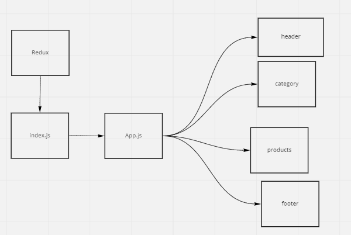

# Getting Started with Create React App

[Pull requests](https://github.com/MohammadAltamimi98/storefront/pulls)

[Live deployment](https://storefront-mohammad.netlify.app/)

## How to run this app?
1. clone this repository
2. insatll dependencies
 ` npm install `
 3. `npm start`

 ## Phase 1 Requirements

 - As a user, I expect to see a list of available product categories in the store so that I can easily browse products.

- As a user, I want to choose a category and see a list of all available products matching that category.

- As a user, I want a clean, easy to use user interface so that I can shop the online store with confidence.

